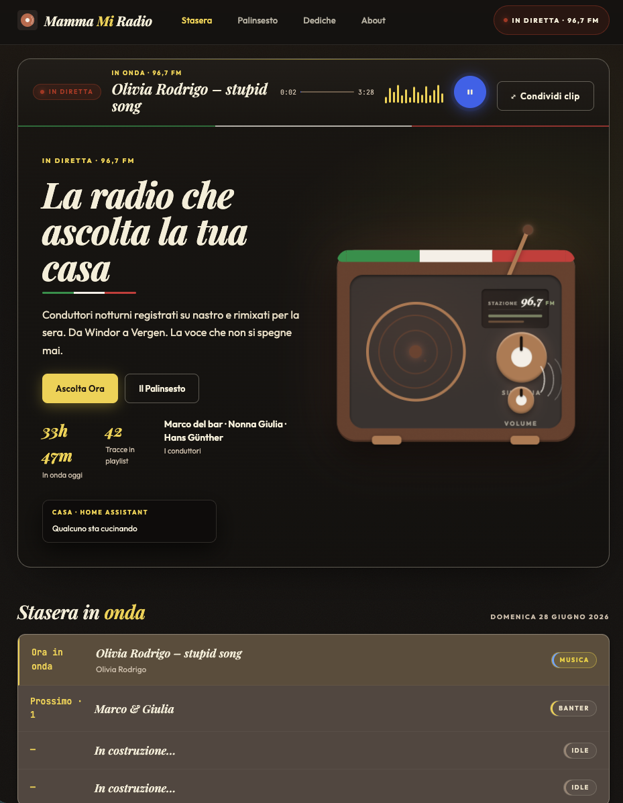
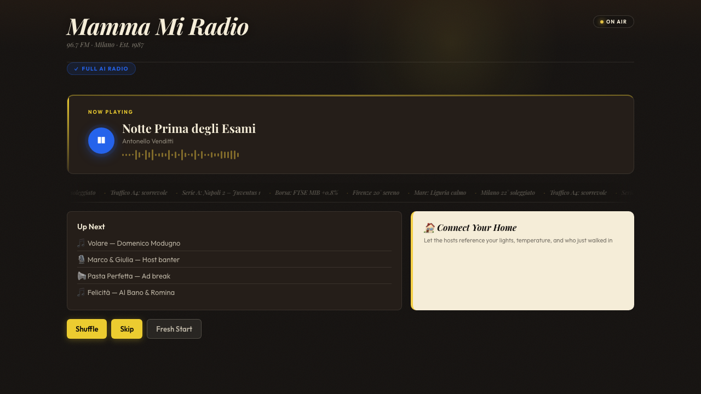

<p align="center">
  
</p>

<p align="center">
  <a href="ARCHITECTURE.md">Architecture</a> &middot;
  <a href="ha-addon/README.md">Home Assistant Add-on</a> &middot;
  <a href="CONTRIBUTING.md">Contributing</a> &middot;
  <a href="CHANGELOG.md">Changelog</a>
</p>

<p align="center">
  
  
  
  
</p>

---

> *We played this at a dinner party. Seven guests. Nobody questioned it was a real Italian radio station.*

---

## Quick Start

### Docker (any platform)

```bash
git clone https://github.com/florianhorner/mammamiradio.git
cd mammamiradio && cp .env.example .env
# Set ADMIN_TOKEN in .env first — required because the container binds to 0.0.0.0
docker compose up
```

Open `http://localhost:8000` for the listener page (`/admin` for the control room). Music plays from live Italian charts when `MAMMAMIRADIO_ALLOW_YTDLP=true` (enabled in `docker-compose.yml`), from CC-licensed tracks via Jamendo (set `jamendo_client_id` in `radio.toml`), or from local files dropped into `music/`.

### Home Assistant Add-on

1. Go to **Settings > Add-ons > Add-on Store** > three-dot menu > **Repositories**
2. Paste: `https://github.com/florianhorner/mammamiradio`
3. Install "Mamma Mi Radio" and start

The add-on wires Home Assistant context automatically. Hosts can reference your lights, temperature, and who's home.

<details>
<summary>More run modes: macOS app, terminal, Conductor</summary>

#### macOS one-click

```bash
./setup-mac.sh
```

Creates a `Mamma Mi Radio.app` for your Dock. Double-click to start, opens the dashboard automatically.

#### Terminal

```bash
# Prerequisites: Python 3.11+, FFmpeg
python3.11 -m venv .venv && source .venv/bin/activate && pip install -e .
./start.sh
```

Open `http://localhost:8000` for the listener page, `/admin` for the control room.

#### Conductor

This repo ships a [`conductor.json`](conductor.json) that handles `.venv` creation, port binding, cache isolation, and `MAMMAMIRADIO_ALLOW_YTDLP=true` by default.

</details>

## What You'll Experience

**It just plays.** `docker compose up` and you have a working radio station. Music from live Italian charts (yt-dlp), CC-licensed tracks via Jamendo, or local files dropped into `music/`. No setup wizard, no API keys needed to hear sound.

**Nobody notices it's AI.** Two Italian hosts banter between tracks, roast each other, react to the music. The format absorbs AI imperfection... timing gaps and rough edges read as radio character, not failure. There is no uncanny valley in radio.

**"How did it know?"** Connect Home Assistant and the hosts reference your actual home. Lights, temperature, who's at the door. "The coffee machine says someone beat you to it." These are moments real radio structurally cannot do.

**The ads are the best part.** Fictional Italian brands with absurd claims, pharma disclaimers read at double speed, dedicated commercial voices. Guests at live tests found them uncanny in a good way... entertaining enough that people actually listen.

**It remembers you.** Returning listeners get recognized. Inside jokes compound across sessions. Hosts build a persona around your listening patterns. The station gets better the more you use it.

**Share the moment.** Hit the clip button to capture the last 30 seconds as a shareable MP3. Send friends the insane ad your radio just made up.

## Screenshots

<p align="center">
  
</p>
<p align="center"><em>Listener dashboard: now playing, up-next queue, radio dial tuning animation on first load</em></p>

<p align="center">
  
</p>
<p align="center"><em>Admin control room: music queue, host config, pacing sliders, engine diagnostics</em></p>

## How It Works

```text
Charts / Jamendo CC / local files / demo -> Producer -> asyncio.Queue -> Playback loop -> /stream
                                         |                                  |
Claude/OpenAI -> banter/ad scripts ------+                                  +-> /public-status, /status
Edge TTS -> dialogue + ads --------------+
FFmpeg -> normalize / mix / concat ------+
Home Assistant -> optional context ------+
```

- `producer.py` keeps a few segments queued ahead of playback.
- `scheduler.py` decides whether the next segment is music, banter, or an ad break.
- `streamer.py` plays one station timeline and fans out MP3 chunks to all connected listeners.

## Three Tiers

The station plays immediately. Add keys to unlock more:

| Tier | What you get | What you need |
|------|-------------|---------------|
| **Demo Radio** | Music + silence fallback for banter and ads | Nothing. Works out of the box. |
| **Full AI Radio** | Claude-written hosts with distinct personalities, reactive banter, dynamic ads | `ANTHROPIC_API_KEY` (falls back to OpenAI) |
| **Connected Home** | Hosts reference live home state: lights, temperature, presence, appliances | Home Assistant + `HA_TOKEN` |

## Never Crashes, Always Plays

The station degrades gracefully instead of failing:

| What's missing | What happens |
|----------------|-------------|
| `MAMMAMIRADIO_ALLOW_YTDLP` not set | Falls back to Jamendo CC music, then local `music/` files, then silence |
| `jamendo_client_id` not set | Skips Jamendo, falls back to local files or charts |
| Anthropic API key | Falls back to OpenAI `gpt-4o-mini`, then stock copy |
| OpenAI API key | Falls back to Edge TTS voices |
| Home Assistant token | Continues without home context |
| Ad brands in config | Skips ads instead of crashing |

Local `music/` directory MP3s are always preferred over network downloads.

## Configuration

Most station behavior lives in `radio.toml`:

| Section | What it controls |
|---------|-----------------|
| `[station]` | Station name, language, theme |
| `[playlist]` | Shuffle behavior, repeat/artist cooldowns, Jamendo CC music (`jamendo_client_id`, `jamendo_tags`) |
| `[pacing]` | Songs between banter, songs between ads, spots per break |
| `[[hosts]]` | Host names, TTS engine (`edge`/`openai`), voices, personality |
| `[audio]` | Sample rate, channels, bitrate, Claude model |
| `[homeassistant]` | HA context toggle, base URL, refresh interval |
| `[[ads.brands]]` | Fictional Italian brand pool, categories, campaign spines |
| `[[ads.voices]]` | Dedicated commercial voices for ads |

Secrets (API keys, passwords) stay in `.env`, never in `radio.toml`.

<details>
<summary>Sharing with friends</summary>

Bind to all interfaces and set an admin password:

```dotenv
MAMMAMIRADIO_BIND_HOST=0.0.0.0
ADMIN_PASSWORD=your-secret-here
```

Share `http://<your-ip>:8000` with listeners. The dashboard and stream are public; admin routes require the password.

</details>

<details>
<summary>Customizing your station</summary>

`radio.toml` is the station's identity. Change the station name, host personalities, ad brands, pacing, and audio settings to make it your own.

The admin dashboard at `/admin` lets you adjust pacing, skip tracks, shuffle the playlist, manage the queue with drag-and-drop, and configure host personalities... all live, without restarting.

</details>

## Development

```bash
make test          # run tests with coverage
make check         # lint + typecheck + coverage gate
```

See [CONTRIBUTING.md](CONTRIBUTING.md) for full local setup, [ARCHITECTURE.md](ARCHITECTURE.md) for runtime flow and API routes, [TROUBLESHOOTING.md](TROUBLESHOOTING.md) for common failures, and [OPERATIONS.md](OPERATIONS.md) for deploy reality.

## Contributors

Thanks to the people who've shaped `mammamiradio`:

- [@florianhorner](https://github.com/florianhorner) — maintainer
- [@ashika-rai-n](https://github.com/ashika-rai-n) — dashboard CSS/JS extraction into `/static/` ([PR #203](https://github.com/florianhorner/mammamiradio/pull/203), [commit `2028d40`](https://github.com/florianhorner/mammamiradio/commit/2028d408499cd98b15c82a39a5cd3912cdfbb1d9))

Want to contribute? See [CONTRIBUTING.md](CONTRIBUTING.md) and pick any open issue. First-time contributors are especially welcome — and are protected by the [merge-first protocol](CLAUDE.md#first-time-contributor-protocol) so your PR lands before any refactoring on top.

## Star History

[](https://star-history.com/#florianhorner/mammamiradio&Date)
