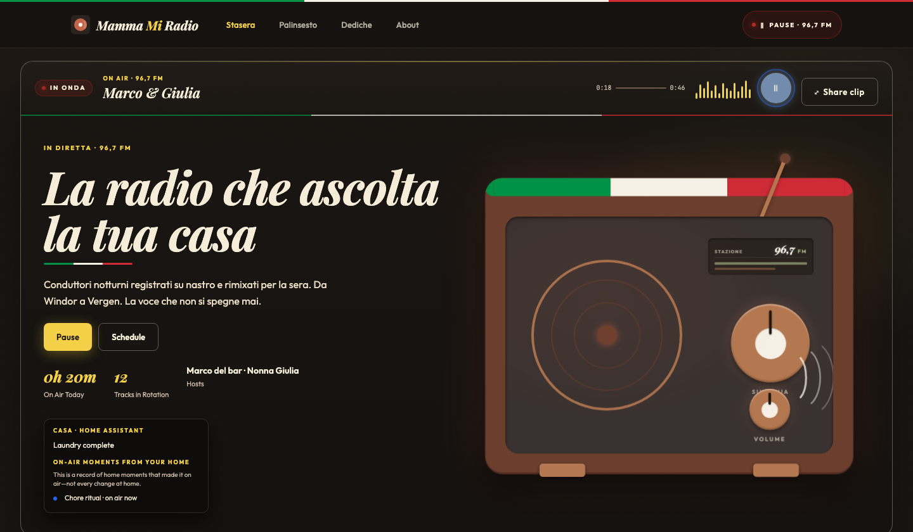
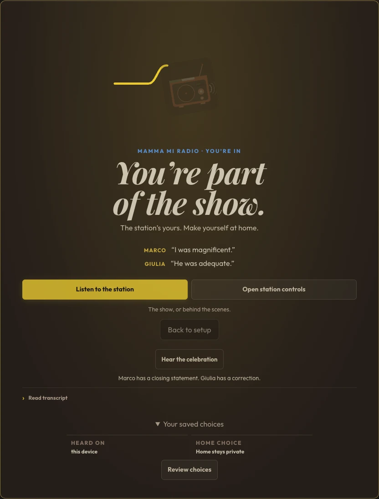
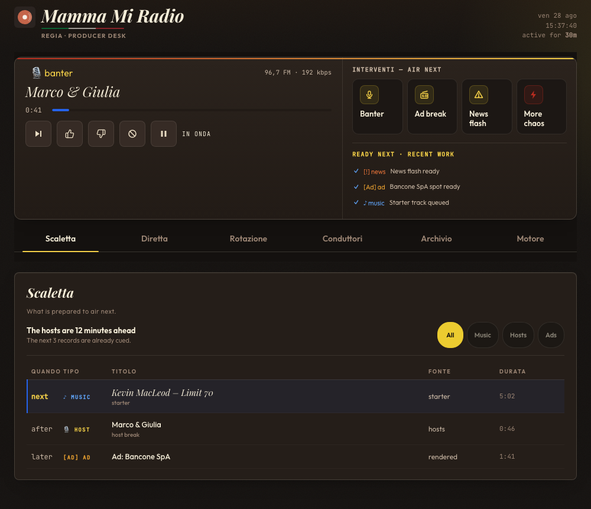

<p align="center">
  <a href="https://florianhorner.github.io/mammamiradio/">
    
  </a>
</p>

<h1 align="center">Mamma Mi Radio</h1>
<p align="center"><em>A radio station that lives in your house and talks about it.</em></p>

<p align="center">
  <a href="https://github.com/florianhorner/mammamiradio/releases"></a>
  <a href="LICENSE"></a>
  
  <a href="https://github.com/florianhorner/mammamiradio/commits/main"></a>
</p>

You built the sensors. You wrote the automations. Your partner still wants to
know why they cannot have a normal light switch instead.

Marco and Giulia host a complete late-night Italian radio show that runs on your own
hardware. They play music, they insult each other just like hosts do, they advertise forty
companies that (fortunately?) do not exist. And if you let them, they make your home part of the show.

> *"Breaking news from the laundry room: it's done. It's been done for two
> hours. Nobody cares but us."*
>
> *"Live from Studio B, Mamma Mi Radio — brought to you by the espresso
> machine. Check your cup. It may already be billing you."*
>
> *"Qualcuno out there just turned on the TV. During our show. During aperitivo hour. On a Friday. I'm not even angry, I'm just taking notes."*

## ▶ [Hear it happen: four moments, 30 seconds each](https://florianhorner.github.io/mammamiradio/)

**Sound on. No install, no account.** Each clip starts as ordinary radio, then
the house turns up as part of the show and the page shows you the exact sensor readings the
hosts were given. This demo runs on invented data and
never touches your Home Assistant.

Two minutes more: **[three short films from Studio B](https://florianhorner.github.io/mammamiradio/shorts/)** — Archive Receipt, Jealous
Microphone, Third Chair. Synthetic voices throughout.

I built this because a smart home is invisible to everyone who did not build
it. And many people don't get excited by presence sensors and humidity sensors in the kitchen, or a clever automation logic. With radio as a medium, you weave your entities into a storyline that anyone can listen to. From a dinner with seven guests: the hosts called me out on air for ignoring the pasta timer, and someone stopped the
conversation to ask what the radio had just said. They didn't question the radio until the first 4th wall break.

<p align="center">
  
</p>
<p align="center"><em>The laundry room made it on air.</em></p>

## What this is, and what it isn't

| It is | It isn't |
|---|---|
| Self-hosted: your hardware, your provider keys, no Mamma Mi Radio account, no telemetry | A cloud service or a subscription |
| A player for twelve licensed starter tracks plus your own local music files | A streaming client — no Spotify, Apple Music, or YouTube |
| Mostly English by default (hosts run roughly 75% English / 25% Italian; **Super Italian** mode switches everything to 100% Italian) | An Italian-only show you will not understand |
| Playable with zero API keys: real music, station imaging, and hosts speaking reviewed stock copy through free Edge voices | An endless, always-fresh show for free — new dialogue needs your own Anthropic or OpenAI key, billed to you |
| Reading only the home details you explicitly approve, previewed before anything is sent | A voice assistant — it takes no commands and controls nothing |
| Two recurring AI hosts with a written show | Real people, or a real station |

Fresh installs keep Home context off. Hear the station, inspect the filtered
preview, then choose what Marco and Giulia may use. The sunset clip in the demo
is the narrowest grant after that choice — daylight and weather only. Laundry,
arrival, and coffee need a wider grant.

**Status:** stable, single maintainer, running daily in one household. The
engineering is further along than the evidence that other people want this —
[the full honest assessment is here](docs/status-quo.md).

## First listen

Home Assistant Apps require **Home Assistant OS**, including Home Assistant
Green and Yellow. Home Assistant Container users can run the [Docker
alternative](#docker-alternative).

[](https://my.home-assistant.io/redirect/supervisor_add_addon_repository/?repository_url=https%3A%2F%2Fgithub.com%2Fflorianhorner%2Fmammamiradio)

You can also add the repository by hand. Open **Settings > Apps > App store >
three-dot menu > Repositories**, paste
`https://github.com/florianhorner/mammamiradio`, and select **Add**. Install and
start **Mamma Mi Radio**, then open its Web UI.

No AI key is required for your first listen. Fresh installs open **First Listen**
at the producer desk (`/admin`). Returning installs open the control room;
you can find First Listen under **Motore -> Setup**.

1. Select **Start sound check**. A 27-second opening plays `/stream` on the
   current device: Marco and Giulia over an original music bed, then the live
   stream. Use its speakers, headphones, Bluetooth, or AirPlay. You need no AI
   key, Home context, or HACS integration. No HACS integration is required.
2. Select **Yes, I hear it** after you hear the opening. Select **Not yet**
   for [repair steps](docs/troubleshooting.md#first-listen-does-not-play-on-this-device).
3. Select **Keep Home private**, or open **See what the hosts would receive**
   before choosing **Let Marco and Giulia use these details**. If the preview
   contains only daylight, the app labels it ambient-only and recommends
   **Keep Home private**.
4. The success screen's **Open full listener** is the seam to the `/listen` station page.
   `/admin` stays the add-on default. Completed admin already has a **Listen** action
   when stages are ready. Install the [HACS
   integration](docs/integrations/ha-integration.md#optional-play-it-on-a-home-assistant-speaker)
   later if you want native `media-source://mammamiradio/live` playback on Home
   Assistant speakers, or the [Music Assistant
   provider](https://www.music-assistant.io/music-providers/mamma-mi-radio/) on
   the 2.10 pre-release channel.

<p align="center">
  
</p>
<p align="center"><em>First broadcast complete. Home stays private.</em></p>

### Docker alternative

<details>
<summary>Run without Home Assistant OS</summary>

```bash
git clone https://github.com/florianhorner/mammamiradio.git && cd mammamiradio
cp .env.example .env
docker compose up      # ADMIN_TOKEN auto-generates if unset
```

Open `http://localhost:8000`. The starter music works offline. Add an AI key
when you want generated host conversations.

The stock Docker setup leaves external extraction off. Standalone installs can
add the `external-media` extra, but technical access does not grant media
rights. The Home Assistant app and supplied Docker container use `/data/music`;
source checkouts use `./music`. Set `MAMMAMIRADIO_MUSIC_DIR` to override either.
macOS users can run `./setup-mac.sh`; venv installs can run `./start.sh`.

</details>

## What each key adds

| You add | The station adds |
|---------|------------------|
| Nothing | Twelve credited tracks, station imaging, the 27-second First Listen, and hosts speaking reviewed stock copy through free Edge voices |
| `ANTHROPIC_API_KEY` or `OPENAI_API_KEY` | Written-on-the-fly banter, news flashes, and ad breaks for forty fictional brands. Billed to you; the control room shows a running estimate |
| OpenAI, Azure Speech, or ElevenLabs voice credentials | The premium voices the hosts were cast with, Edge as the fallback |
| An AI key plus approved, filtered Home context | The details you allowed — an arrival, a forgotten load of laundry, a timer you are ignoring |

One OpenAI key covers both writing and voice. Azure Speech and ElevenLabs
change only the voices.

## Privacy

On a fresh install, Home context is off. The **Host home context** choice is
omitted and remains off until you hear the station, inspect the filtered
preview, and explicitly choose **Let Marco and Giulia use these details**. The
station does not poll Home state for host material. You can keep Home private
without fetching a preview. If you want household details on air, mute any
entity the hosts should ignore. Previewing does not publish the snapshot into
host scripts or send it to an AI provider.

With Home context on and an AI host key set, the approved, filtered details may
go to that provider to write the show and extract post-air memory. That memory
is only written after generated material airs, and only while Home context
stays on. Without a script key, no Home context reaches an AI writing
provider. Generated writing and premium voices use online services; Edge TTS
is online too.

Turning Home context off stops Home-state and timer polling. It cancels
Home-derived generation and memory work, removes queued Home-derived breaks,
and clears public Casa moments. Audio on air may finish to avoid dead air, but
it cannot write Home memory afterward. Home Assistant entity publishing can
stay on while host context stays off.

The station itself runs on your hardware. Mamma Mi Radio has no account system,
central service, or telemetry. Provider calls use your own keys. In the Home
Assistant app, saved keys live in `/config/secrets.env`; the UI never echoes
them.

## Music

Normal rotation starts with the offline, attributed twelve-track starter
collection, so no provider account or network music source is required. The
listener shows the source, license, and modification notice for each track.
The Home Assistant app scans audio under `/data/music`; use **Rotazione >
Local music > Scan now** to refresh without a restart. Standalone installs can
set `MAMMAMIRADIO_MUSIC_DIR`.

Jamendo is off by default. To enable it, acknowledge non-commercial use.
Provider confirmation for this station model remains pending. The station
prepares one track at a time and deletes it after play or cancellation. Jamendo
is not a recovery or restart source. Read [Music sources and rights
boundaries](docs/music-sources.md) before enabling it.

Packaged recovery clips keep the speaker path audible while the music source
stays marked unhealthy.

## Make it yours

`radio.toml` defines the hosts, voices, pacing, and ad brands. The `/admin`
control room lets you reorder the queue, ban a song on air, change AI quality,
and switch between Festival, Chaos, and Super Italian modes. See the full
configuration in [`.env.example`](.env.example) and [Operations](docs/operations.md).

<p align="center">
  
</p>
<p align="center"><em>The control room is there when you want it.</em></p>

## Operator checks

<details>
<summary>Health, readiness, and repeatable QA</summary>

`Producer started` means the engine started. `/readyz` stays at `503 starting`
until a listener accepts audio, returns `200` with `"ready": true` after that,
and reports `503 stopped` during an intentional stop. Queue depth and elapsed
time do not prove that anyone heard the station.

First Listen remains the human check: hear **Mamma Mi Radio** on the current
device. For branch development, use the [disposable Home Assistant
lab](docs/runbooks/first-listen-local-ha.md) to keep test state away from your
live home.

</details>

## Docs

[Interactive demo](https://florianhorner.github.io/mammamiradio/) |
[Product status](docs/status-quo.md) |
[Architecture](docs/architecture.md) |
[Music sources and rights](docs/music-sources.md) |
[Troubleshooting](docs/troubleshooting.md) |
[Operations](docs/operations.md) |
[Repo map](docs/REPO_MAP.md)

## Contributing

Issues and pull requests are welcome. Start with
[CONTRIBUTING.md](CONTRIBUTING.md). The merge-first protocol protects a new
contributor's patch from being refactored out from under them before it lands.

## License

The code is [Apache-2.0](LICENSE). Each bundled asset keeps its own license and
attribution. The [imaging attribution
file](mammamiradio/assets/imaging/ATTRIBUTION.md) covers station imaging.
Starter music uses CC BY sources from Incompetech (4.0) and Jamendo (3.0);
Jamendo facts are provider-reported. You remain responsible for the media your
station plays and the words it puts on air. See [Music sources and rights
boundaries](docs/music-sources.md).
