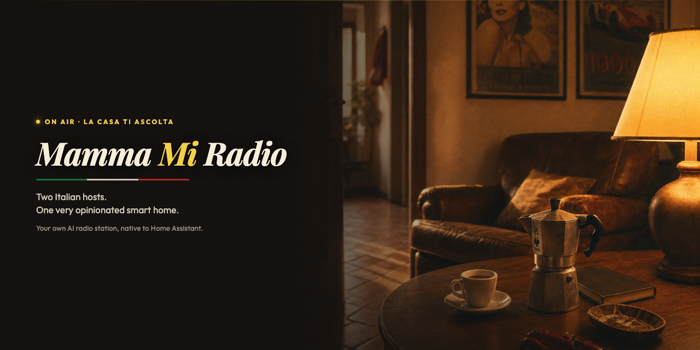

<p align="center">
  
</p>

# Mamma Mi Radio

Italian radio for Home Assistant, with no AI key required. A fresh station
opens with an authored 27-second mini-show ready to send to one real speaker:
an original music bed and a privacy-aware Marco/Giulia opening, followed by a
source-aware handoff to the live stream. Add more music, Home context, and
generated host conversations only when you want them.

## First listen: on the device you already have open

**Hear it on the current device before you choose what the hosts may use.**
Install and start the Home Assistant OS app below, then open the producer desk
at `/admin`. First Listen plays `/stream` here — laptop speaker, headphones,
Bluetooth, or AirPlay. No HACS integration is required. A fresh unfinished
install opens **First Listen** automatically; completed installs return to the
control room, with review and repair under **Motore → Setup**:

1. The opening card explains the authored 27-second mini-show: an original
   music bed, Marco and Giulia's privacy-aware welcome, then a handoff to the
   live stream. It needs no AI key and reads no Home context. Source readiness
   for live charts, Jamendo, local music, bundled demo music, and recovery cover
   sits underneath as supporting detail. It says whether primary music,
   recovery cover, or a music repair is what follows; bundled demo music is not
   presented as a song library.
2. Select **Start sound check**. Confirm with **Yes, I hear it** only after you
   hear Mamma Mi Radio, or **Not yet** for
   [warm repair steps](docs/troubleshooting.md#first-listen-does-not-play-on-this-device).
3. Select **Keep Home private** without reading Home state, or
   **See what the hosts would receive** before
   **Let Marco and Giulia use these details**.
   If the preview contains only generic daylight, the UI discloses it as
   ambient-only and not meaningful personalization, and recommends keeping it
   private. Add an AI key later if you want generated hosts; it is not part of
   first audio.
4. The success screen's **Open full listener** is the seam to the `/listen` station page.
   `/admin` stays the add-on default. Completed admin already has a **Listen** action
   when stages are ready. Home Assistant speakers remain an
   [optional later route](docs/integrations/ha-integration.md#optional-play-it-on-a-home-assistant-speaker).

### Home Assistant OS app

Home Assistant Apps require **Home Assistant OS** (including Home Assistant Green and Yellow). Home Assistant Container does not include Apps; if you do not have **Settings → Apps**, use the Docker alternative below.

[](https://my.home-assistant.io/redirect/supervisor_add_addon_repository/?repository_url=https%3A%2F%2Fgithub.com%2Fflorianhorner%2Fmammamiradio)

Or by hand: **Settings → Apps → App store → ⋮ → Repositories**, paste `https://github.com/florianhorner/mammamiradio`, and select **Add**. Open **Mamma Mi Radio**, select **Install**, then **Start**.

### What first audio needs

No AI key is required for your first listen: without one, the hosts use stock
copy and fallback voices. The packaged 27-second First Listen mini-show makes
the original music bed, station identity, and Marco/Giulia opening audible
immediately, but it is not the song library. Normal rotation starts with the
offline, attributed twelve-track starter collection, so no provider
account or network music source is required. Open the listener and use **Music
credits** to see the exact source, license, and modification notice for what is
playing. Operator-supplied audio in the add-on's `/data/music` directory is
discovered automatically; standalone installs can set `MAMMAMIRADIO_MUSIC_DIR`.

Jamendo is an optional, default-off transient expansion for acknowledged
non-commercial API use while provider confirmation is pending. Configure it
later in **Motore -> Setup -> Music sources**; starter music keeps playing while
it prepares one track at a time. Packaged recovery audio can still prove the
speaker transport without pretending that a damaged music source is healthy.
See [Music sources and rights boundaries](docs/music-sources.md).

First audio is separate from home context. On every fresh install, the
**Host home context** choice is omitted and remains off until you hear the
station, request a fresh filtered preview, and explicitly choose **Let Marco
and Giulia use these details**.
Previewing does not publish the snapshot into host scripts or send it to an AI
provider. If that preview contains only generic daylight, it is shown for
transparency but classified as ambient-only—not meaningful personalization—and
**Keep Home private** is recommended. That private choice preserves
Home Assistant entity publishing while suspending Home-state polling, timer
reads/interrupts, and Home-derived host work.

### Check the app (operators)

`Producer started` in the app log means the engine came up. `/readyz` answers a
stricter question: it stays `503 starting` until a listener has actually accepted
audio (`503 stopped` while the station is deliberately paused), so
`"ready": true` is already proof that someone heard the station, not just that
the process booted. Neither replaces the first-listen check: hear
**Mamma Mi Radio** on the current device.

For branch development or repeatable manual QA, use the [disposable local Home
Assistant lab](docs/runbooks/first-listen-local-ha.md). It preserves the local
HA/VLC speaker setup between radio-only resets and keeps branch code and test
state away from the live home.

### Docker alternative

<details>
<summary>Run it without Home Assistant Apps</summary>

```bash
git clone https://github.com/florianhorner/mammamiradio.git && cd mammamiradio
cp .env.example .env
docker compose up      # ADMIN_TOKEN auto-generates if unset
```

Open `http://localhost:8000`. The bundled starter collection works offline and
needs no AI or music-provider key; add an AI key when you want generated hosts.
The stock Docker quickstart keeps external extraction off. A standalone install
may deliberately add the `external-media` extra, but technical access is not a
rights claim. Its persistent music path is `/data/music`; set
`MAMMAMIRADIO_MUSIC_DIR` when running outside the supplied container layout.
(Also: macOS one-click `./setup-mac.sh`, or `./start.sh` in a venv. Conductor
users get `scripts/conductor-*.sh` lifecycle hooks for free.)

</details>

→ **[How it works](docs/architecture.md)** · **[Contribute](CONTRIBUTING.md)** · **[Changelog](CHANGELOG.md)**

## When you want the house in the show

A song's playing. As it winds down, one of the hosts leans in: "The coffee
machine just started, someone's home early, and it's 14 degrees in here.
Classic Tuesday."

You built the sensors. You wrote the automations. Now somebody finally notices.

## See it

**[Watch Studio B Transmissions](https://florianhorner.github.io/mammamiradio/shorts/)**

<p align="center">
  
</p>
<p align="center"><em>The listener page: la radio che ascolta la tua casa.</em></p>

<p align="center">
  
</p>
<p align="center"><em>The control room: live now-playing, the queue, and one-tap banter / ad / news.</em></p>

> *"Breaking news from the laundry room: it's done. It's been done for two hours. Nobody cares but us."*

<p align="center">
  
  
  
</p>

---

> *We played this at a dinner party. Seven guests. Nobody questioned it was a real Italian radio station.*

---

## What you get

It starts in layers, and climbs from there:

| Step | You bring | What your home does |
|------|-----------|---------------------|
| **Hear it first** | Nothing | The First Listen mini-show plays right here on this device, then Demo Radio uses the attributed offline starter collection and a shipped 21-clip bank of reviewed Marco-and-Giulia host breaks. It selects only the clips safe for the active language mode, while stock copy, fallback voices, and recovery cover remain underneath. |
| **Wake the hosts** | An `ANTHROPIC_API_KEY` or `OPENAI_API_KEY` | The hosts come alive: reactive banter and the gloriously fake Italian ad breaks. |
| **Give your home a voice** | AI host key plus prompt-safe Home Assistant context | The admin shows the filtered home context first. Mute any entity locally, then the hosts can notice your house: lights, locks, who just got home. |

"Demo Radio" is the no-AI-key host tier; music still begins with the bundled,
attributed starter collection. The first step lets you hear the station before
you trust it with your house. The last step is the point.

The starter collection is the dependable first-run rotation. Recovery clips
and eligible local cache can still bridge thin-queue moments, but Jamendo is
never a recovery or restart source.

It runs on your hardware with your own AI keys: no account, no servers of ours, no telemetry. In the add-on, saved keys live in `/config/secrets.env`; the UI never echoes them. When Host home context is on and an AI host key is ready, the admin preview shows the filtered context that may go to the AI you picked for host writing and for post-air memory extraction after generated banter streams cleanly. Mute any entity there to keep it out of future host/context use. Turning Host home context off cancels Home-derived generation and post-air extraction, removes unstarted Home-derived breaks, clears public Home moments, and stops Home/timer polling. Audio already on air may finish so privacy revocation does not create dead air, but it cannot publish post-air Home memory afterward. The Home Assistant integration remains separate, so entity publishing can stay on while Host home context is off; running without script-provider credentials also prevents host context from reaching an AI provider.

## Make it yours

`radio.toml` is the station's identity (hosts, voices, pacing, ad brands). The `/admin` control room tunes it live: pacing, drag-and-drop queue, ban-the-song-on-air, an AI-quality dial, and personality modes (Festival, Chaos, Super Italian). Full config lives in [`.env.example`](.env.example) and [docs/operations.md](docs/operations.md).

## Docs

[Product status](docs/status-quo.md) · [Architecture](docs/architecture.md) · [Music sources & rights boundaries](docs/music-sources.md) · [Troubleshooting](docs/troubleshooting.md) · [Operations & deploy](docs/operations.md) · [Repo map](docs/REPO_MAP.md)

## Contributing

Issues and PRs welcome. Start with [CONTRIBUTING.md](CONTRIBUTING.md). First-time contributors are protected by a merge-first protocol, so your PR lands before any refactor on top.

## License

The code is [Apache-2.0](LICENSE). Each bundled asset keeps its own license and
attribution. The [imaging attribution file](mammamiradio/assets/imaging/ATTRIBUTION.md)
documents station imaging. Starter music uses attribution-only CC BY sources (4.0 from Incompetech, 3.0 from Jamendo).
Jamendo facts are provider-reported. Operators are responsible for local and
externally resolved media. See the canonical [music-source
boundaries](docs/music-sources.md). You are also responsible for what your
station plays and says.

[](https://star-history.com/#florianhorner/mammamiradio&Date)
