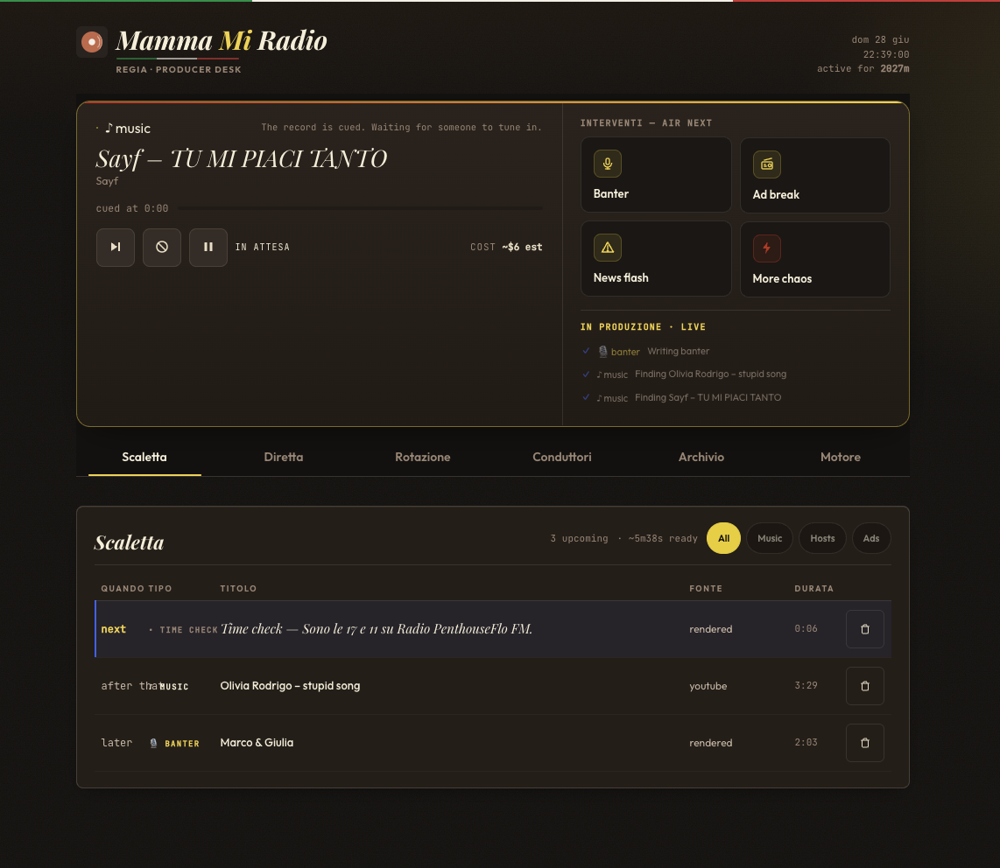

<p align="center">
  
</p>

# Home Assistant Add-ons: Mamma Mi Radio

Add-on repository for [mammamiradio](https://github.com/florianhorner/mammamiradio), an AI-powered Italian radio station.

## Installation

1. In Home Assistant, go to **Settings > Add-ons > Add-on Store**
2. Click the three dots menu (top right) > **Repositories**
3. Paste this URL: `https://github.com/florianhorner/mammamiradio`
4. Click **Add**, then find "Mamma Mi Radio" in the store
5. Click **Install**

### Stable vs Edge

The store shows two add-ons from this repository:

- **Mamma Mi Radio** — the stable channel. Updates only on deliberate releases.
- **Mamma Mi Radio (Edge)** — tracks the latest development build. Updates on every change merged to `main`. For testing only — not meant for daily listening.

Install one or the other; they cannot run at the same time (both use port 8000). See `docs/runbooks/ha-addon.md` → "Edge channel" for details.

## Configuration

After installing, go to the add-on's **Configuration** tab:

- **Station Name**: Customize your station's name (default: "Mamma Mi Radio").
- **Jamendo Client ID** (optional): Enables CC-licensed music from Jamendo. Get a free client ID at [devportal.jamendo.com](https://devportal.jamendo.com). Leave empty to use other available music sources.
- **AI Quality**: Pick Premium, Balanced, or Economy. The station chooses the right model per task.
- **Enable Home Assistant**: Toggle ambient home context in hosts' banter (default: on).
- **Admin Token** (optional): Shared secret for the admin API. If blank, the add-on trusts your local network — any device on your LAN can open the admin panel (writes stay protected against cross-site requests). Set a value to require the token even on your LAN.
- **Super Italian Mode**: On, the hosts speak fully in Italian and the listener page goes Italian. Off (default), the hosts speak about 70% English with real Italian moments.
- **Chaos Mode**: Restore host-chaos mode across restarts when enabled.
- **Festival Mode**: Restore theatrical music-competition mode across restarts when enabled.
- **On-Air Sound**: Toggle the subtle FM-style output colouring (default: off).
- **On-air media player push**: On by default — the station appears in Home Assistant as a media player automatically. Turn it off if you install the HACS integration (which provides a controllable media player and would otherwise fight this push); the station's sensors keep working either way.

### Provider keys (not in the Configuration tab)

AI/TTS credentials live in `/config/secrets.env` inside the add-on config folder. You do not need them before first listen: start the add-on, open the Web UI, and hear Demo Radio first. Then save one AI host key from **Motore → Setup → AI hosts**, which writes the file for you, or create it by hand. `ANTHROPIC_API_KEY` or `OPENAI_API_KEY` unlocks generated hosts; `AZURE_SPEECH_KEY`, `AZURE_SPEECH_REGION`, and `ELEVENLABS_API_KEY` are optional premium voice providers. Keys saved through the old Configuration-tab fields by earlier versions move into the secrets file automatically the first time the updated add-on starts; non-empty file values win per key.

## Usage

1. Start the add-on
2. Open it from the HA sidebar / ingress entry first. The mapped `:8000` port is mainly for `/stream`, `/healthz`, and direct diagnostics
3. Hear Demo Radio with no provider keys; the dashboard shows your station's current tier (Demo Radio, Full AI Radio, or Connected Home) and a guide for what to set up next
4. Set **Station Name** to the name people should see and hear; entity IDs and `media-source://mammamiradio/live` stay stable
5. Add `ANTHROPIC_API_KEY` or `OPENAI_API_KEY` from **Motore → Setup → AI hosts** to unlock live AI hosts
6. Review **Home context preview** and mute any entity the hosts should never use. Supervisor Home Assistant access is automatic in add-on mode, but filtered home context is useful only after an AI host key is ready
7. Install the HACS integration for the controllable `media_player.mammamiradio`
   entity and native `media-source://mammamiradio/live` casting

`/config/secrets.env` is a plaintext file in the add-on config storage, not Home Assistant's `/config/secrets.yaml`. Anyone with host/add-on config access can read it; it exists to keep provider credentials out of Supervisor options and diagnostics.

The add-on also exposes unauthenticated `/healthz` and `/readyz` probes for monitoring. The richer setup checks live behind the admin UI at `/api/setup/status`, `/api/setup/recheck`, and `/api/setup/addon-snippet`.

### Playing on speakers

With the HACS integration installed, play the radio on a smart speaker or media
player through the native media source:

```yaml
service: media_player.play_media
target:
  entity_id: media_player.your_speaker
data:
  media_content_id: media-source://mammamiradio/live
  media_content_type: music
```

Without the HACS integration, direct `/stream` still works:
`http://[YOUR_HA_IP]:8000/stream`.

## Screenshots

The admin control room gives you the station at a glance: now playing, up-next queue, controls, and setup prompts:



The listener page is a clean, mobile-friendly player for anyone on your network:


## What it does

- Streams a continuous AI-generated Italian radio station
- Hosts reference your actual Home Assistant state (lights, temperature, who's home)
- Remembers returning listeners across sessions with compounding persona memory
- Rotates between music, host banter, and absurd fake Italian ads
- Falls back gracefully when optional services are unavailable
