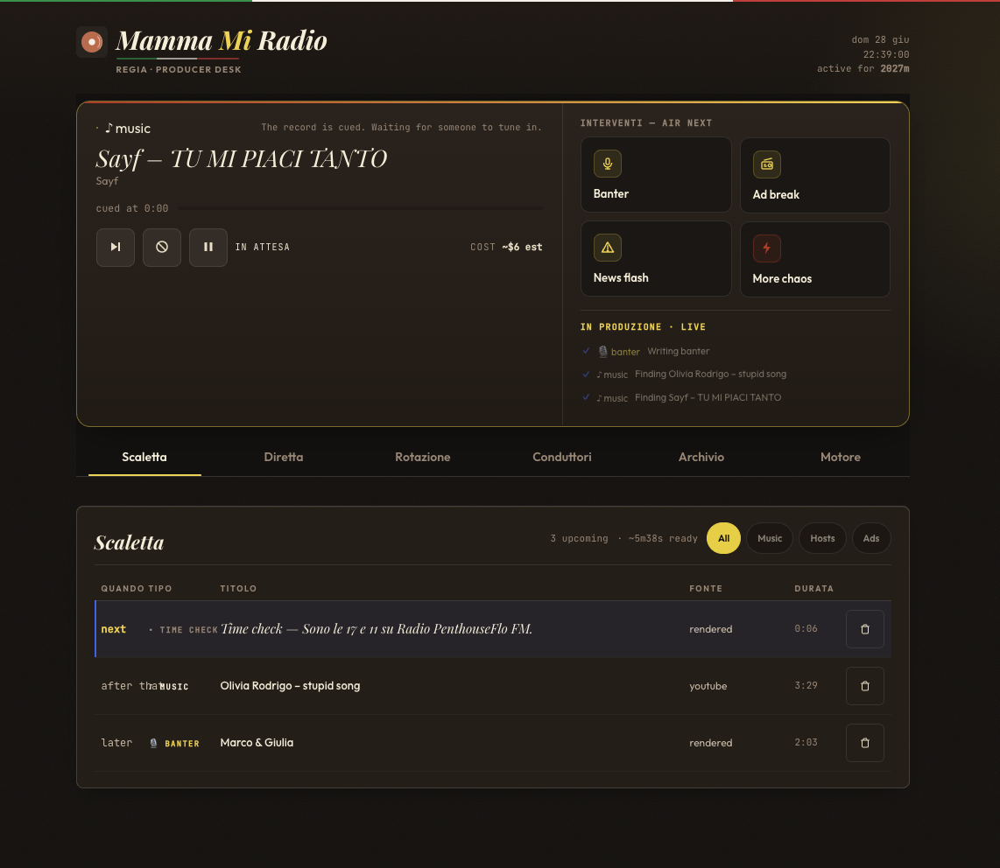
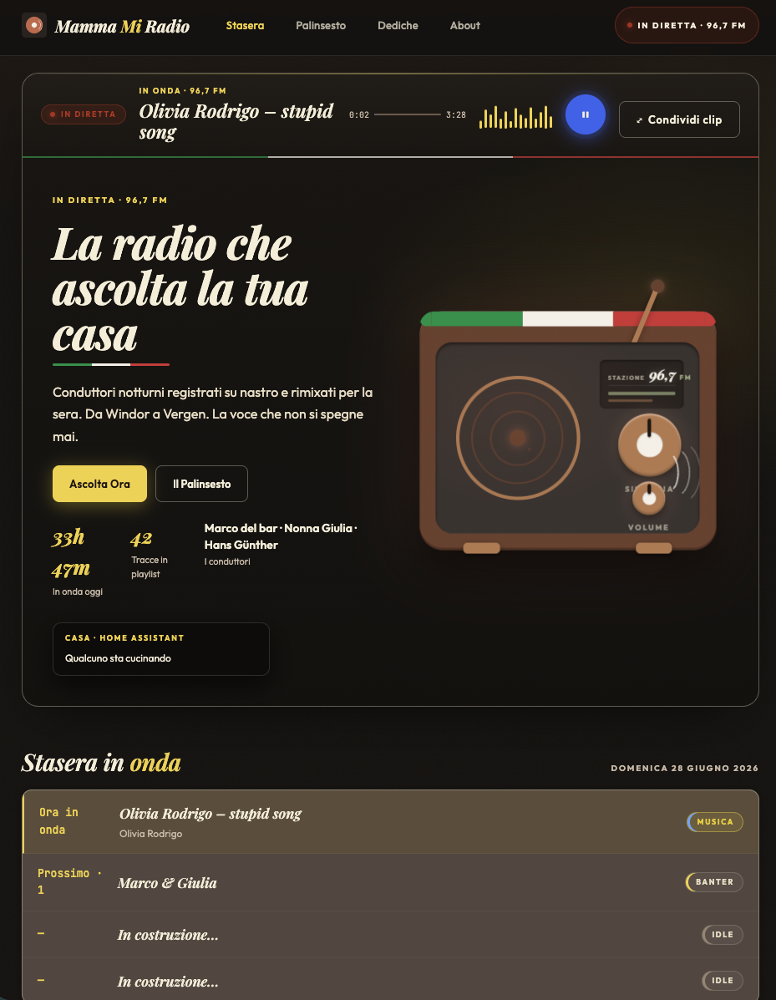

<p align="center">
  
</p>

# Home Assistant app repository: Mamma Mi Radio

App repository for [mammamiradio](https://github.com/florianhorner/mammamiradio), an AI-powered Italian radio station.

## Installation

Home Assistant Apps require **Home Assistant OS**. Home Assistant Container does not include Apps; if **Settings > Apps** is missing, use the [Docker alternative](../README.md#docker-alternative) instead.

1. In Home Assistant, go to **Settings > Apps** and select **App store**
2. Open the three-dot menu (top right) and select **Repositories**
3. Paste `https://github.com/florianhorner/mammamiradio` and select **Add**
4. Open **Mamma Mi Radio** in the store and select **Install**
5. Select **Start**, then open the Web UI

### Stable vs Edge

The store shows two apps from this repository:

- **Mamma Mi Radio** — the stable channel. Updates only on deliberate releases.
- **Mamma Mi Radio (Edge)** — a deliberately cut development channel pinned to the newest tested `main` image available when the maintainer runs `make edge-release`; that pin may trail `main`. For testing only — not meant for daily listening.

Install one or the other; they cannot run at the same time (both use port 8000). See the [add-on release runbook](../docs/runbooks/ha-addon.md#edge-channel-dev-releases) for Edge details.

Both add-ons use the same attributed offline starter catalog. Neither image
contains the `yt-dlp` distribution, Python module, or executable; legacy
extractor-enablement settings are ignored.

## Configuration

After installing, go to the add-on's **Configuration** tab:

- **Station Name**: Customize your station's name (default: "Mamma Mi Radio").
- **AI Quality**: Pick Premium, Balanced, or Economy. The station chooses the right model per task.
- **Enable Home Assistant Integration**: The master Home Assistant connection (default: on). It enables entity publishing, optional host context, and timer interrupts. Turn it off only when the station should run without Home Assistant access.
- **Host home context**: A separate privacy choice. Fresh installs leave it off until First Listen audio is confirmed and you explicitly enable a fresh filtered preview; proven pre-feature installs retain their prior behavior. Turning it off keeps entity publishing but stops full-state and timer reads/interrupts plus Home-derived host generation and memory work.
- **Host context refresh interval**: How often that filtered prompt-context snapshot refreshes (default: 300 seconds).
- **Admin Token** (optional): Shared secret for the admin API. If blank, the add-on trusts your local network — any device on your LAN can open the admin panel (writes stay protected against cross-site requests). Set a value to require the token even on your LAN.
- **Super Italian Mode**: On, the hosts speak fully in Italian and the listener page goes Italian. Off (default), the hosts target about 75% English with real Italian moments.
- **Chaos Mode**: Restore host-chaos mode across restarts when enabled.
- **Festival Mode**: Restore theatrical music-competition mode across restarts when enabled.
- **On-Air Sound**: Toggle the subtle FM-style output colouring (default: off).
- **Guest host**: Keep the rotating guest host in the line-up, or turn him off for regular hosts only. Takes effect after restart.
- **Pacing**: Set songs between host breaks, songs between ad breaks, and ads per break. These are the same Diretta controls from the admin panel, saved across restarts.
- **On-air media player push**: On by default — the station appears in Home Assistant as a media player automatically. Turn it off if you install the HACS integration (which provides a controllable media player and would otherwise fight this push); the station's sensors keep working either way.

### Provider keys (not in the Configuration tab)

The offline starter catalog needs no key and no network. AI/TTS credentials
live in `/config/secrets.env` inside the add-on config folder. Without an AI
key, the hosts use stock copy and fallback voices. Save one AI host key from
**Motore → Setup → AI hosts**, which writes the file for you.
`ANTHROPIC_API_KEY` or `OPENAI_API_KEY` unlocks generated hosts. OpenAI also
provides premium voices; Azure Speech and ElevenLabs are voice-only options and
do not complete the AI-host step by themselves. Azure is ready only when both
`AZURE_SPEECH_KEY` and `AZURE_SPEECH_REGION` are present; a partial pair is
shown as incomplete. Keys saved through the old Configuration-tab fields
by earlier versions move into the secrets file automatically the first time the
updated add-on starts; non-empty file values win per key.

Jamendo is a separate, optional music source under **Motore → Setup → Music
sources**. It is off by default and requires both your client ID and an explicit
non-commercial-use acknowledgement. Tracks are prepared one at a time and
deleted after play or cancellation. License facts shown by the app are
provider-reported, and provider confirmation for this station model remains
pending. Read the [music-source and rights guide](../docs/music-sources.md)
before enabling it.

## Usage

1. Start the add-on
2. Open it from the HA sidebar / ingress entry first. The mapped `:8000` port is mainly for `/stream`, `/healthz`, and direct diagnostics
3. Confirm the log shows `Producer started`. `/readyz` remains HTTP `503` with
   `status: "starting"` until a listener accepts audio, then returns HTTP `200`
   with `"ready": true`; queued work and elapsed startup time do not prove
   readiness. The complete attributed starter rotation works offline without a
   provider key.
4. If HACS is not installed, follow its [official installation
   guide](https://www.hacs.xyz/docs/use/download/download/). Then install the
   [Mamma Mi Radio
   integration](../docs/integrations/ha-integration.md#install-the-hacs-integration-for-speaker-playback)
   for native `media-source://mammamiradio/live` playback and restart Home
   Assistant once.
5. A fresh unfinished install opens **First Listen** automatically with an
   authored 27-second mini-show on deck: an original music bed and a
   privacy-aware Marco/Giulia opening, then a source-aware handoff to the live
   stream. It needs no AI key or Home context. The attributed offline starter
   catalog is the normal base rotation; source readiness also distinguishes
   local music, optional Jamendo, and recovery cover.
6. Select **Find my speakers**, choose one real Home Assistant speaker, then select **Start Mamma Mi Radio**. Confirm **Yes — that’s Mamma Mi Radio** only after the opening reaches the room. Use **Not yet** for repair and same-speaker retry. The tab remains available later, and the media source stays `media-source://mammamiradio/live`.
7. Select **Keep private and continue** without fetching Home state, or show the fresh filtered preview before selecting **Let future hosts use this**. A daylight-only preview is disclosed as ambient-only and not meaningful personalization, so the private path is recommended. Mute any useful entity the hosts should never use; room-presence stays off unless you explicitly allow it as a personal on-air moment. The Home Assistant integration and **Host home context** remain separate: turning host context off keeps entity publishing while stopping full-state and timer reads, host-context polling, and Home-derived host work. Filtered context becomes useful to generated host copy after an AI host key is ready.
8. Set **Station Name** to the name people should see and hear; entity IDs and the media-source URI stay stable.
9. Add `ANTHROPIC_API_KEY` or `OPENAI_API_KEY` from the now-unlocked **AI hosts — optional** step if you want generated hosts. It is never required for first audio.
10. Optionally configure Jamendo under **Motore → Setup → Music sources** after reviewing and accepting the current non-commercial-use boundary.

`/config/secrets.env` is a plaintext file in the add-on config storage, not Home Assistant's `/config/secrets.yaml`. Anyone with host/add-on config access can read it; it exists to keep provider credentials out of Supervisor options and diagnostics.

Supervisor's stored app options are the durable authority for Super Italian,
Chaos, Festival, AI Quality, On-Air Sound, and pacing. Changes from the control
room save there before the running station changes. `/data/options.json` is a
Supervisor-generated, read-only startup projection; the app reads it when
starting and never writes it directly. A selection held only in memory by an
older build cannot be recovered after an update rematerializes an older
Supervisor value.

The add-on also exposes unauthenticated `/healthz` and `/readyz` probes for monitoring. `/healthz` reports process/runtime health: an intentional Stop normally stays healthy, while prolonged silence with active listeners returns `503`. `/readyz` reports `503 starting` on a fresh or Resumed session until a listener actually accepts audio, `200 ready` after that proof, and `503 stopped` during an intentional Stop; queued work or elapsed startup time alone is not readiness. The richer setup checks live behind the admin UI at `/api/setup/status`, `/api/setup/recheck`, and `/api/setup/addon-snippet`.

### Playing on speakers

With the HACS integration installed, play the radio on a smart speaker or media
player through the native media source:

```yaml
service: media_player.play_media
target:
  entity_id: media_player.your_speaker
data:
  media_content_id: media-source://mammamiradio/live
  media_content_type: music
```

Without the HACS integration, direct `/stream` still works:
`http://[YOUR_HA_IP]:8000/stream`.

## Screenshots

The admin control room gives you the station at a glance: now playing, up-next queue, controls, and setup prompts:



The listener page is a clean, mobile-friendly player for anyone on your network:



## What it does

- Streams a continuous Italian radio station; an AI host key optionally adds generated conversations
- After a fresh filtered preview and explicit enablement, hosts may reference only the authorized, prompt-safe subset of Home Assistant state
- Remembers returning listeners across sessions with compounding persona memory
- Rotates between music, host banter, and absurd fake Italian ads
- Falls back gracefully when optional services are unavailable
